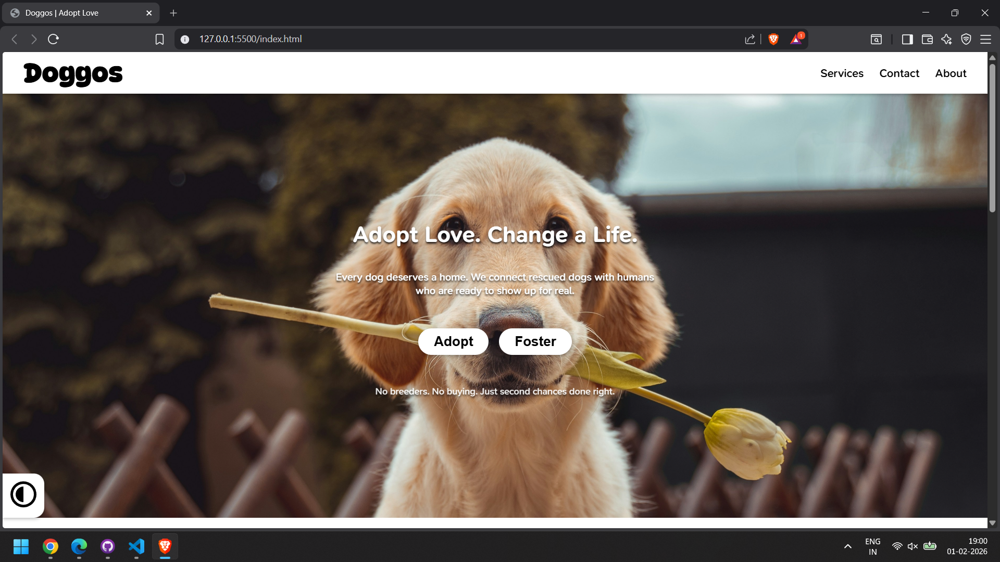
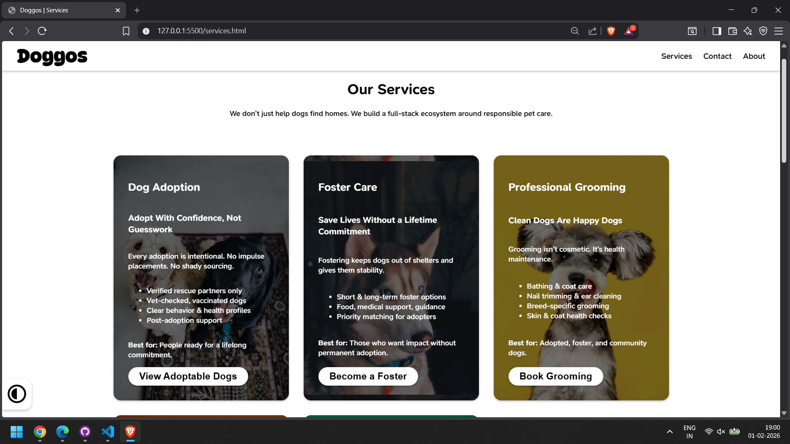
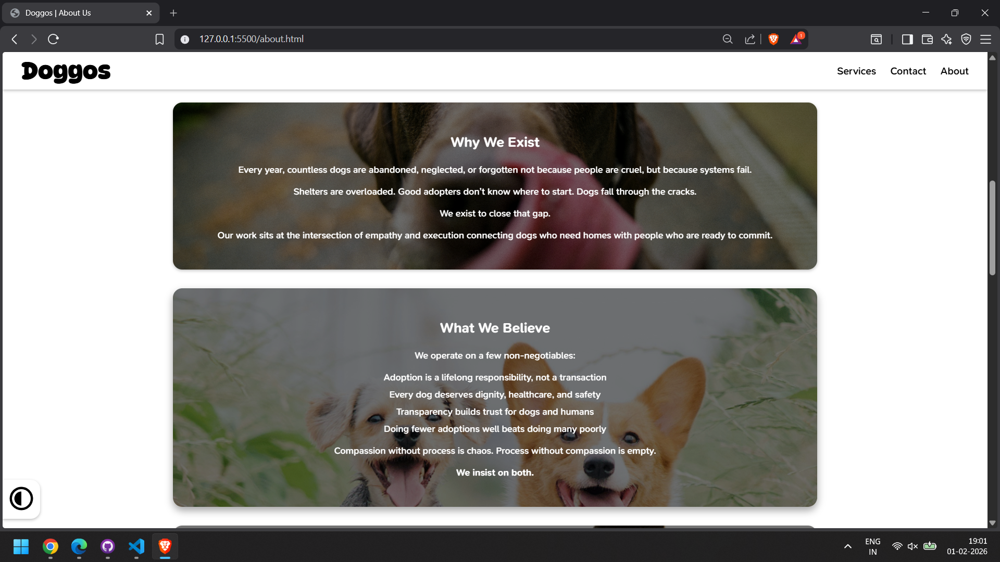
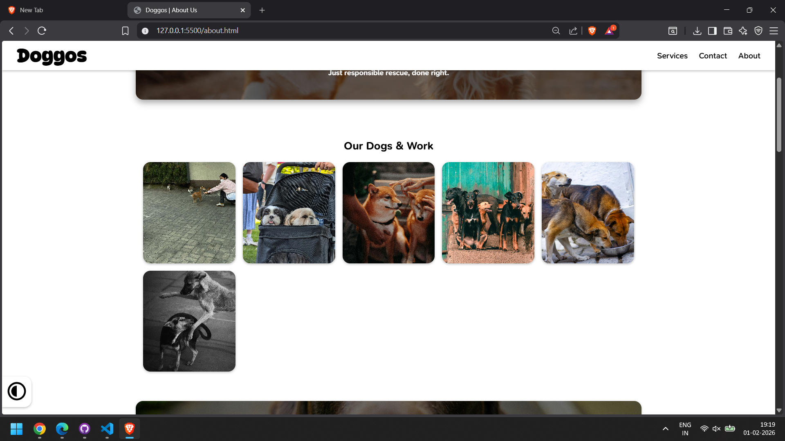
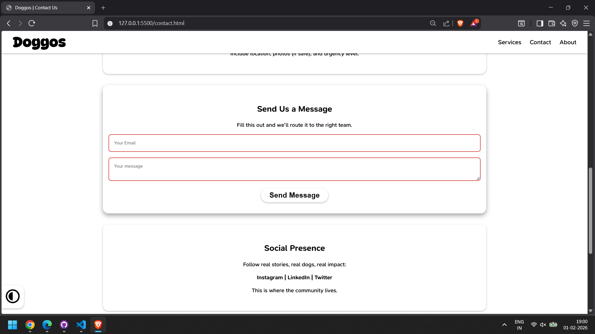

# Doggos — Ethical Dog Adoption & Animal Welfare Platform

## Project Description

Doggos is a responsive, multi-page website designed to promote ethical dog adoption and responsible pet ownership. The platform helps users:

- Adopt dogs through verified shelters  
- Foster dogs temporarily  
- Book grooming and veterinary check-ups  
- Explore dog toys and accessories  

The website focuses on transparency, ethical practices, and long-term animal welfare rather than impulsive adoption.

### Problem It Solves

Dog adoption systems are often fragmented, opaque, and emotionally driven without proper structure. Potential adopters struggle to find reliable information, verified shelters, and post-adoption support.

Doggos addresses this by:
- Centralizing adoption-related services in one platform  
- Promoting ethical, verified rescue partners only  
- Encouraging informed, responsible adoption decisions  

### Target Audience

- Individuals and families looking to adopt a dog responsibly  
- People interested in fostering animals temporarily  
- Pet owners seeking grooming or veterinary services  
- Animal welfare organizations and ethical shelters  

---

## Tech Stack

### Frontend
- HTML5  
- CSS3 (Flexbox, Grid, Media Queries, Animations)  
- JavaScript (Vanilla JS)

### Backend
- None (static frontend project)

### Database
- None

### Deployment
- GitHub Pages  

---

## Screenshots

  
  
  
  
  

---

## Live Demo

The project is deployed using GitHub Pages.

**Live Link:**  
https://username.github.io/doggos/

---

## What I Learned

### Technical Learnings
- Built a fully responsive multi-page website using Flexbox and CSS Grid  
- Implemented reusable components such as cards, navigation bars, and footers  
- Used CSS variables (`:root`) for consistent theming and maintainability  
- Applied form validation using HTML attributes and CSS pseudo-classes  
- Created image galleries and pricing tables using semantic HTML  

### Challenges & Solutions
- **Responsive navigation:** Solved using a mobile-first approach with media queries and JavaScript-based menu toggling  
- **Layout consistency across pages:** Addressed by designing reusable CSS utility classes  
- **Visual hierarchy and readability:** Improved through spacing, typography, and component-based layout  

### Best Practices Improved
- Semantic HTML structure for accessibility and clarity  
- Separation of concerns between HTML, CSS, and JavaScript  
- Clean folder structure and maintainable styling  
- Writing project documentation suitable for recruiters and collaborators  

---

## Author

Built as a front-end web development project focused on responsive design, clean UI, and ethical product thinking.
